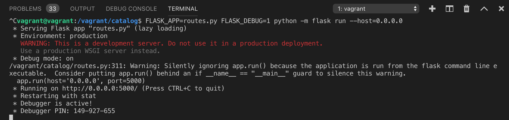

# Item Catalog project

## Project summary
#### Item Catalog project provides a list of items within a variety of categories as well as provide a user registration and authentication system. Registered users will have the ability to post, edit and delete their own items.

Using RESTful web application, Python framework Flask along with implementing third-party OAuth authentication(Google Auth2).

## Pre-Requisites and Preparation
* Python 2.7
* PSQL database
* Vagrant 
* VirtualBox

## Prepare the Vagrant VM
Clone the [fullstack-nanodegree-vm](https://github.com/udacity/fullstack-nanodegree-vm) repository. There is a catalog folder provided for you, but no files have been included. If a catalog folder does not exist, simply create your own inside of the vagrant folder.

* Launch the Vagrant VM (by typing vagrant up in the directory fullstack/vagrant from the terminal).
* Logging into the Linux VM with (by typing vagrant sshfrom the terminal).

## Downlaod the project 

#### Fork the starter repo
log into your personal Github acccount, and fork  [GitHub: ItemCatalog](https://github.com/Michsedki/ItemCatalog)

#### Clone the remote to your local machine
From terminal,run this command(replace `<UserName>` with your GitHub username):
`git clone https://github.com/<UserName>/udacity_Project_1 news_data_analysis`

#### Copy all files to the shared vagrant file in your vagrant VM.

## How to Use

#### Setup the Database
* Run the database_setup.py file using python: write this command in your terminal `python database_setup.py`

* Run the lotsofCategory.py file using python: write this command in your terminal `python lotsofCategory.py`

#### Run the Application
* Run the routes.py file using Flask: write this command in your terminal `FLASK_APP=routes.py FLASK_DEBUG=1 python -m flask run --host=0.0.0.0`

## Screen Preview

#### the homepage displays all current categories along with the latest added items.
In your browser write this url: `http://localhost:5000/`

#### Selecting a specific category shows you all the items available for that category.
URL: `http://localhost:8000/catalog/Animals/items`

#### Selecting a specific item shows you specific information of that item.
URL: `http://localhost:8000/catalog/dog/show`

#### After logging in, a user has the ability to add, update, or delete item info.

URL: `http://localhost:8000/` (Logged In).

URL: `http://localhost:8000/catalog/Cat/show` (Logged In).

URL: `http://localhost:8000/catalog/Cat/edit` (Logged In).

URL: `http://localhost:8000/catalog/Cat/delete` (Logged In).

#### The application provides a JSON endpoint.

URL: `http://localhost:8000/catalog.json`

## Code Design
#### The Project contains :

1. README.MD (This File)
2. database_setup.py
3. lotsofCategory.py
4. templates folder
5. Images folder (ScreenShots Images).
6. routes.py (ItemCatalog Application source code).

